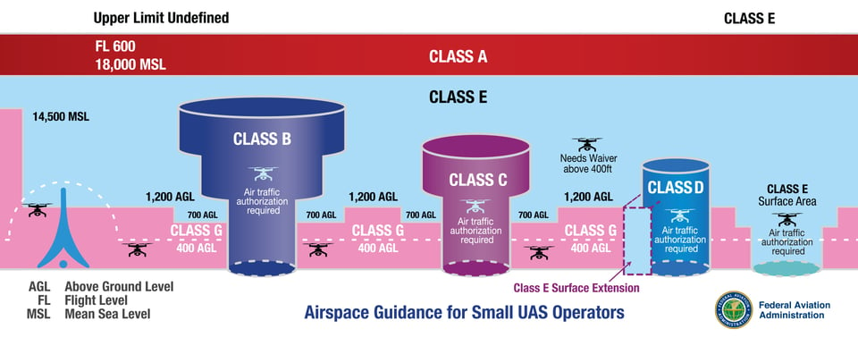
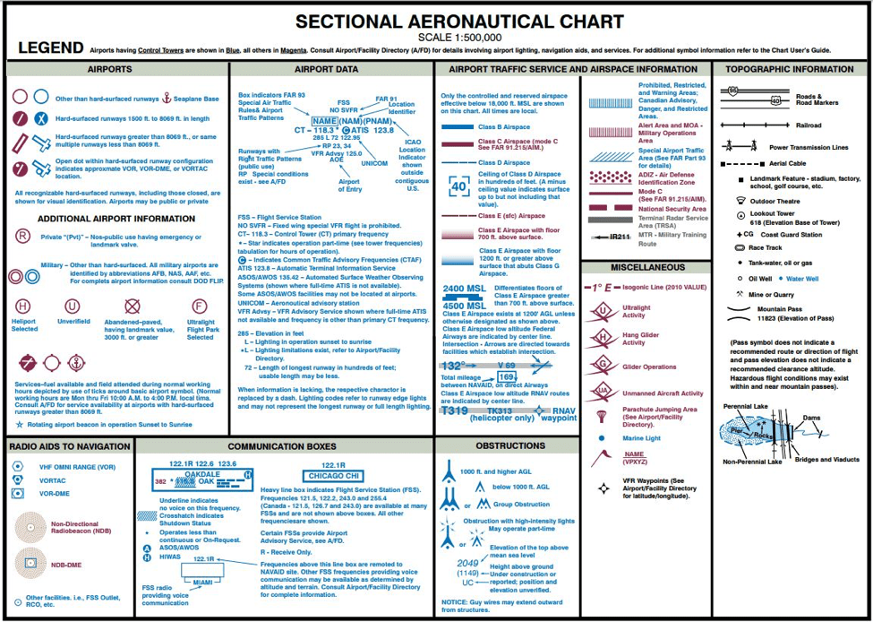

# Quick References

## Airspace Guide







- [1800wxbrief Interactive Map](https://www.1800wxbrief.com/Website/interactiveMap;jsessionid=D7B76BAA0C4102BD644561CEDB9D95C8)
  - To see NOTAMS & Sectional Charts
- [DJI Fly Safe Drone Map](https://www.dji.com/mobile/flysafe/geo-map#)
  - Simple map from DJI to locate restricted airspaces
- [B4UFLY App](https://www.faa.gov/uas/getting_started/b4ufly)
  - App from the FAA that allows you to request access to controlled airspaces.
  


